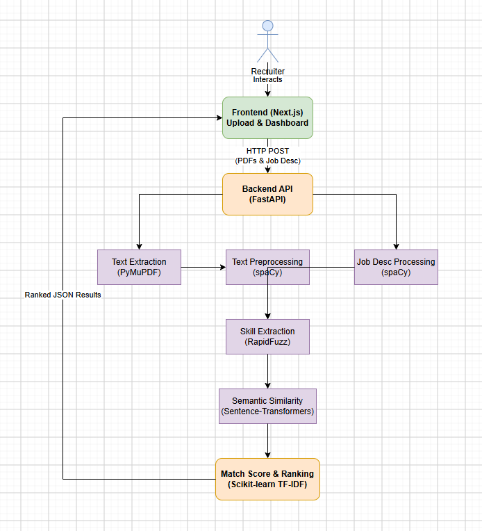
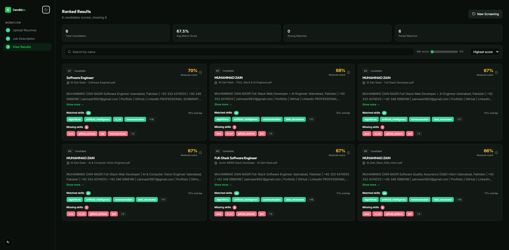

# AI-Powered Resume Screening & Candidate Ranking System

An AI-powered recruitment assistant that analyses resumes against a job description and ranks candidates by relevance.

**Live Demo:** [Add your live URL here]()

## 1. Project Overview

This application is an intelligent recruitment tool designed to assist HR professionals and hiring managers in processing large volumes of resumes. By automatically extracting text from uploaded resumes and comparing them against a provided job description, the system provides a clear, explainable ranking of candidates. It highlights matched skills and identifies areas where a candidate's experience might be lacking, ultimately saving recruiters time and helping them focus on the most relevant applicants.

## 2. Problem Statement

Recruiters often receive hundreds of applications for a single open role. Manually reviewing each resume is not only incredibly time-consuming but can also lead to inconsistent candidate comparisons and human fatigue. Traditional keyword-matching systems can easily overlook strong candidates who use different terminology to describe their skills. Recruiters need a smart, explainable shortlisting tool that understands the context of a candidate's skills and helps them make fair, data-driven decisions without replacing human judgement.

## 3. Objectives

- **Upload candidate resumes**: Seamlessly accept multiple PDF resumes in a single batch.
- **Extract text from resumes**: Accurately pull text from uploaded PDF documents.
- **Process and clean resume text**: Normalise, clean, and tokenise text data.
- **Extract relevant skills/information**: Identify technical skills, tools, and professional competencies.
- **Accept a job description**: Allow users to paste or upload the requirements for the open role.
- **Compare resumes against the job description**: Measure the alignment between candidate skills and role requirements.
- **Generate a matching score**: Produce a quantifiable metric of candidate relevance.
- **Rank candidates**: Order applicants from most relevant to least relevant.
- **Display matched and missing skills**: Provide explainable evidence for the generated score.
- **Provide a recruiter-friendly interface**: Deliver a fast, intuitive, and easy-to-use dashboard.

## 4. Features

### F-01: Resume Upload
- Support for uploading multiple PDF files simultaneously.
- Graceful error handling for unsupported file types.

### F-02: Text Extraction
- Robust PDF parsing capable of handling multi-page and standard multi-column layouts.

### F-03: NLP Processing
- Text cleaning, lowercasing, and whitespace normalisation.
- Tokenisation, stop-word removal, and lemmatization using NLP pipelines.
- Preservation of important technical tokens (e.g., C++, .NET, Node.js).

### F-04: Skill Extraction
- Extraction of technical skills, frameworks, and tools.
- Resolution of skill aliases to canonical names (e.g., matching "JS" to "JavaScript") using fuzzy matching.

### F-05: Job Description Processing
- Accepts typed or pasted job descriptions.
- Extracts core required skills and competencies from the text for comparison.

### F-06: Candidate Matching
- Calculates a similarity score by comparing the resume's extracted content with the job description.
- Uses a hybrid approach involving semantic document similarity and specific skill overlap.
- Normalises the final score to a percentage (0–100%).

### F-07: Candidate Ranking
- Ranks all candidates deterministically from highest score to lowest.
- Displays both the rank and the match score clearly on the dashboard.

### F-08:  Missing Skills Analysis
- Identifies **matched skills** present in both the resume and the job description.
- Highlights required skills that are **not clearly found** in the candidate's resume, avoiding the assumption that the candidate completely lacks them.

### F-09: Recruiter Dashboard
- An interactive UI showing candidate name, match score, matched skills, not-clearly-found skills, a brief summary, and overall ranking.

## 5. Architecture



### Pipeline Walkthrough

1. **Resume Upload**: The recruiter uploads a batch of PDF resumes and provides a job description via the frontend interface.
2. **PDF Text Extraction**: The backend extracts raw text from the uploaded PDFs using PyMuPDF.
3. **Text Preprocessing**: The raw text undergoes normalisation, tokenisation, and lemmatization via SpaCy, ensuring technical terms are preserved.
4. **Skill Extraction**: The system identifies and standardises skills from both the resumes and the job description, mapping aliases to canonical terms using RapidFuzz.
5. **Job Description Processing**: The target job description is processed using the identical NLP pipeline to ensure a fair comparison baseline.
6. **Embedding / Similarity**: The system calculates TF-IDF vectors and leverages Sentence Transformers to compute cosine similarity between the candidate's profile and the job description.
7. **Matching Score**: A final, normalised score is generated by weighting semantic similarity alongside direct skill overlap.
8. **Candidate Ranking**: Candidates are sorted deterministically based on their final matching scores.
9. **Recruiter Dashboard**: The ranked results, along with explainable skill match breakdowns, are returned to the Next.js frontend for the recruiter to review.

## 6. Technology Stack

| Technology | Purpose | Why |
|---|---|---|
| **Python** | Core backend language | Industry standard for data processing and machine learning. |
| **FastAPI** | Backend framework | High performance, async support, and auto-generated API docs. |
| **PyMuPDF** | PDF extraction | Highly reliable and fast text extraction from complex PDFs. |
| **spaCy** | NLP | Robust tokenisation, part-of-speech tagging, and linguistic processing. |
| **scikit-learn** | TF-IDF / similarity | Simple, explainable vectorisation and cosine similarity calculations. |
| **Sentence-Transformers** | Semantic matching | Captures deeper contextual meaning beyond simple keyword matching. |
| **RapidFuzz** | String matching | Extremely fast fuzzy matching for skill alias resolution. |
| **Next.js & React** | Frontend framework | Modern, reactive, and fast recruiter-facing dashboard. |
| **Tailwind CSS** | Styling | Rapid, consistent UI development. |

## 7. Installation

### Clone the Repository

```bash
git clone <repository-url>
cd resume-screening-system
```

### Backend (Server) Setup

```bash
cd server

# Create a virtual environment
python -m venv venv

# Activate it (Windows)
venv\Scripts\activate
# OR Activate it (macOS/Linux)
# source venv/bin/activate

# Install dependencies
pip install -r requirements.txt

# Download required spaCy model
python -m spacy download en_core_web_sm
```

*Note: The Sentence-Transformers model will automatically download the first time you run the backend (approx. 100-500MB depending on the specific model).*

Set up your backend environment variables:
```bash
# Windows
copy .env.example .env
# macOS/Linux
# cp .env.example .env
```

### Frontend (Client) Setup

Open a new terminal and navigate to the client folder:
```bash
cd client

# Install dependencies
npm install
```

Set up your frontend environment variables:
```bash
# Windows
copy .env.local.example .env.local
# macOS/Linux
# cp .env.local.example .env.local
```

## 8. Usage

### Step 1: Start the Backend Server
In your activated Python virtual environment (inside the `server` directory), run:
```bash
python -m app.main
```

### Step 2: Start the Frontend Client
In a new terminal (inside the `client` directory), run:
```bash
npm run dev
```

### Step 3: Access the Dashboard
Open [http://localhost:3000](http://localhost:3000) in your web browser.

### Step 4: Run a Screening Workflow
1. **Upload Resumes**: Use the file upload interface to upload multiple candidate PDF resumes.
2. **Job Description**: Paste the target job description into the text area.
3. **Screen**: Initiate the NLP processing and matching pipeline.
4. **Review**: The system will display a ranked list of candidates. Review the matched skills, the not-clearly-found skills, and the overall relevance scores.

*Note: The system recommends an order; the recruiter makes the final hiring decision.*

## 9. Screenshots

### File Upload


### Job Description


### Ranked Results


## 10. Example Results

### Job Description
Looking for a Backend Developer with experience in Python, FastAPI, PostgreSQL, Docker, and CI/CD pipelines.

### Results

| Rank | Candidate | Score | Matched Skills | Not Clearly Found |
| ---- | --------- | ----: | -------------- | ----------------- |
| 1 | Candidate A | 88% | Python, FastAPI, Docker | PostgreSQL, CI/CD |
| 2 | Candidate B | 75% | Python, PostgreSQL | FastAPI, Docker, CI/CD |
| 3 | Candidate C | 54% | Python | FastAPI, PostgreSQL, Docker, CI/CD |

## 11. Project Structure

```text
resume-screening-system/
├── client/                     # Next.js Frontend Application
│   ├── app/                    # Next.js App Router pages and global layouts
│   ├── components/             # Reusable React components (UI elements)
│   ├── lib/                    # Utility functions and API clients
│   └── package.json            # Frontend dependencies
├── server/                     # FastAPI Backend Application
│   ├── app/                    # API routes and core logic
│   ├── data/                   # Sample data and taxonomy files
│   ├── tests/                  # Backend unit and integration tests
│   ├── requirements.txt        # Python dependencies
│   └── .env.example            # Example backend environment variables
├── assets/                     # Architecture diagrams and screenshots
└── README.md                   # Project documentation
```

## 12. Future Work

- **Better Semantic Matching**: Upgrading to larger LLMs to better understand the nuanced context of candidate achievements rather than just skill mentions.
- **Experience & Education Extraction**: Parsing specific years of experience and educational degrees to provide more granular filtering for recruiters.
- **Multilingual Support**: Extending the NLP pipeline to process and screen resumes written in different languages, supporting global hiring efforts.
- **Vector Database Integration**: Storing processed candidate embeddings in a vector database (like Pinecone or Milvus) to allow instant querying of past applicants for new roles.

## 13. Limitations

### Similarity is a proxy
A high textual similarity score is a proxy for relevance, but it does not guarantee that the candidate is actually the most suitable or capable person for the job.

### Vocabulary Bias
The scoring mechanism inherently favours candidates whose resume vocabulary closely mirrors the phrasing of the job description. Candidates who possess the skills but describe them differently might receive lower scores.

### Scanned PDFs
Image-only or heavily formatted graphic resumes may result in poor or entirely failed text extraction, directly degrading the candidate's resulting score.

### Finite Skill Taxonomy
The system's skill dictionary and alias mapping cannot contain every possible technology, framework, or variation, meaning some niche skills might be missed during explicit skill matching.

### Human Judgement
The system evaluates text. It cannot reliably assess a candidate's motivation, integrity, soft communication skills, growth trajectory, or cultural team fit.

## 14. Responsible AI / Decision Support

This system is built as a **decision-support tool, not an autonomous hiring system**. It ranks candidates and provides supporting evidence based on textual data. It does not make hiring decisions or automatically reject candidates. Final review and decisions must always remain with the human recruiter to ensure fairness and holistic evaluation.

## 15. Author

**Muhammad Zain Nasir**

<br />

[](https://muhammad-zain-nasir.vercel.app/)
[](https://www.linkedin.com/in/muhammadin-zain-nasir)
[](https://github.com/mzainnasir010)
